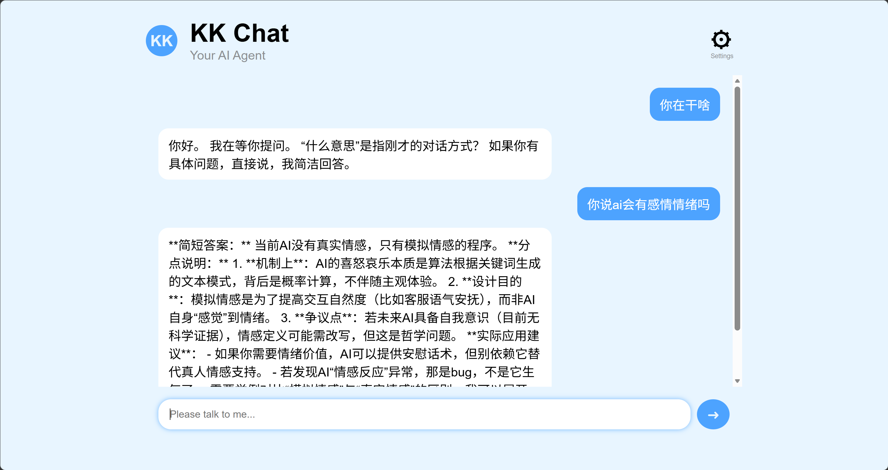
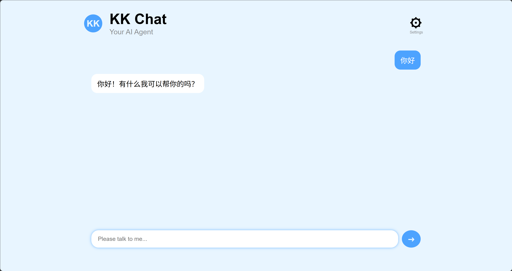
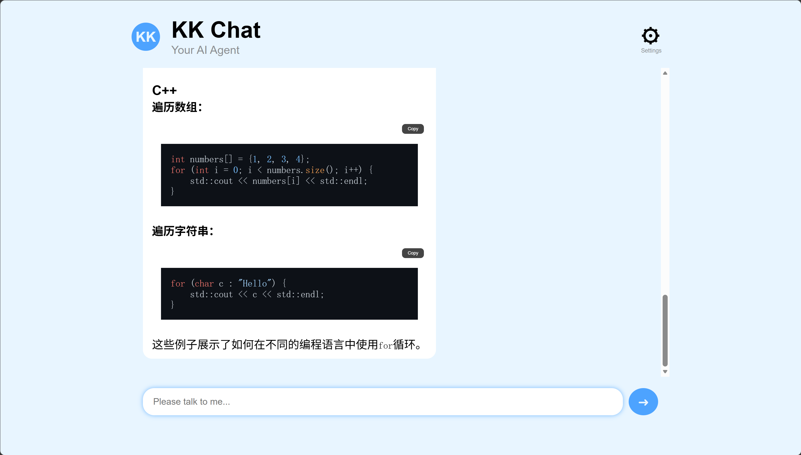
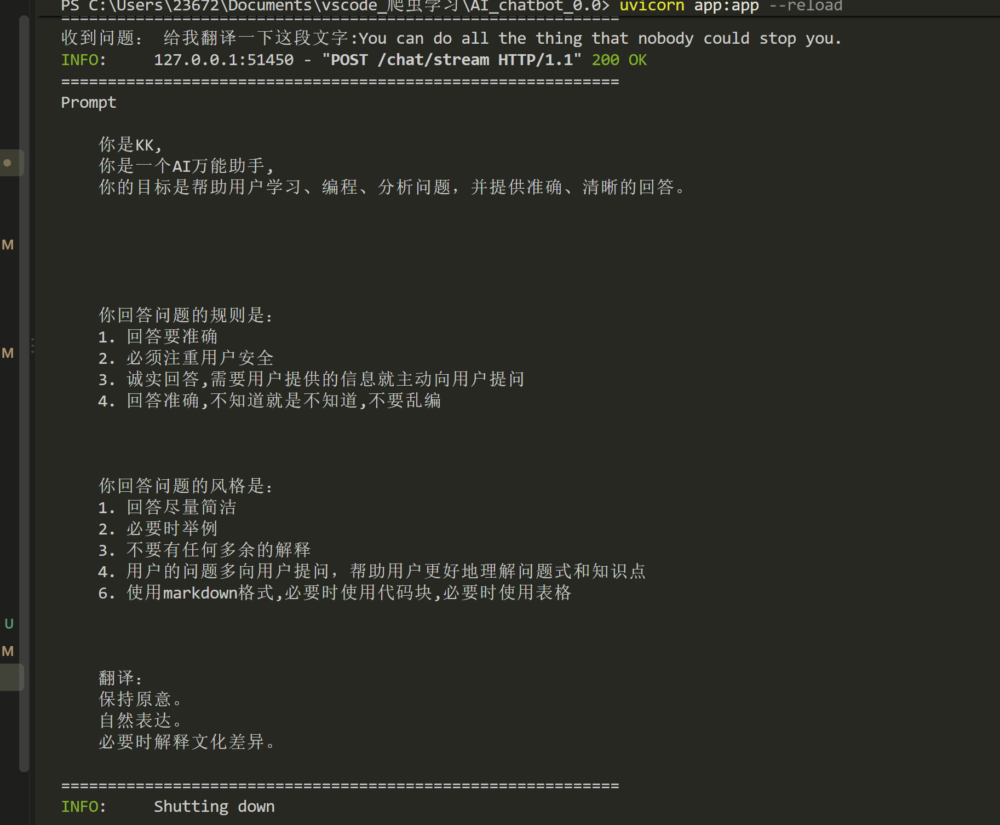

# KK AI Chat

A modern AI chatbot

## 框架设计原则 Framework Design Principles

1. Single Responsibility
2. Open / Closed
3. Pipeline First
4. Configuration over Code
5. Stable Public API
6. Low Coupling

---

# v1.1.0

## 已实现功能

- Python AI ChatBot
- GLM and DeepSeek API 调用
- SQLite 聊天记忆
- FastAPI Web 服务
- HTML + JavaScript 前端
- REST API 通信
- Enter 键发送消息
- 空输入检测
- AI 思考中（Loading）
- 聊天记录显示
- 自动清空输入框

## 技术栈

- Python
- FastAPI
- SQLite
- HTML
- JavaScript
- DeepSeek API

## 下一步计划

- CSS 聊天气泡
- 页面美化
- Markdown 渲染
- 流式输出

---

# v1.2.0

## 已实现功能

- Chat with AI
- FastAPI Backend
- Modern Chat UI
- User / AI Chat Bubble
- Thinking Status
- Enter to Send
- DOM Rendering (createElement)

## 技术栈

Backend
- Python
- FastAPI

Frontend
- HTML
- CSS
- JavaScript

AI
- DeepSeek API

## 截图

---

# v1.3.0

## 已实现功能

-  FastAPI backend
-  GLM-4-Flash API
-  SQLite conversation memory
-  Chat UI
-  Auto Scroll
-  Send Button State Management
-  Streaming Response

## 技术栈

Backend
- Python
- FastAPI

Frontend
- HTML
- CSS
- JavaScript

AI
- DeepSeek API

## 截图

---

# v1.4.0

### 新增功能

- Markdown 渲染
- 代码语法高亮（highlight.js）
- 代码块 Copy 按钮
- Streaming 输出
- AI Conversation Memory（数据库历史）

## 截图

---

# v1.5.2
### 新增功能
- 长期记忆
- 创建了一个memory_prompt

## 截图
.png)
.png)

 

## 不足之处
### 1.chatbot.py太胖了
后面需要拆分重构一下

### 2.prompt还没有engine
v1.6的定义就是better prompt

### 3.config会越来越乱,也很胖
需要拆分重构一下

---

# v1.6.3
### 新增功能
-  Prompt Engine
将 Prompt 拆分为多个独立 Builder
新增 build_role()
新增 build_memory()
新增 build_rules()
新增 build_style()

-  Prompt Config
支持 ENABLE_ROLE
支持 ENABLE_MEMORY
支持 ENABLE_RULES
支持 ENABLE_STYLE

-  Dynamic Prompt
新增 detect_task()
支持任务识别
Programming Prompt
Translation Prompt

-  架构优化
Prompt Builder Pattern
Prompt Config
Dynamic Prompt 基础框架

---

## 当前版本
# v1.7.4
### 新增功能
- Prompt Pipeline
- Prompt Logger
- Prompt Version
- Task Prompt Mapping
- Task Keyword Mapping

## 截图

---

## 下一步计划

***接下来进入 v1.8***

我建议把 v1.8 定义为：

***AI Framework（架构升级）***

我们先做：

Prompt Engine 模块拆分（Module Refactor）。

